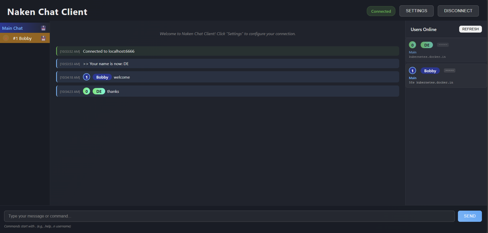

# Naken Chat Client

A modern, full-featured web client for [Naken Chat](https://www.mikekohn.net/software/nakenchat.php) servers, with a beautiful, responsive UI, multi-tab private messaging, chat history export, emoji and URL parsing, and a sidebar user list. Connects to Naken Chat servers via a local WebSocket proxy.

## Features

- **Modern Full-Page UI**: Responsive, full-page layout with header, sidebar user list, vertical tabbed chats, and a polished dark theme
- **Multi-Tab Private Messaging**: Each private chat opens in its own tab, with flashing for new messages and seamless switching
- **Chat History Export**: Download chat history for any tab as a file; history is cached in localStorage per tab
- **WebSocket Proxy**: Bridges HTML5 client to Naken Chat servers
- **Emoji & URL Parsing**: Text emojis (e.g., `:D`, `:P`, `:)`) are converted to real emojis; URLs are clickable and open in new tabs
- **User List Sidebar**: Live, clickable user list with channel and permission info; usernames styled as pills
- **Username Highlighting**: Your username is highlighted in all chats and user lists
- **Command Support**: Full support for all Naken Chat server commands
- **Robust Message Routing**: Private messages are routed to the correct tab, with compatibility for different server confirmation styles
- **Settings Persistence**: Remembers your connection settings
- **Cross-Server Compatibility**: Handles different server behaviors for private message confirmations
- **Real-time Chat**: Live message updates with timestamps
- **History Management**: All chat and private histories are cleared on connect/disconnect to avoid mismatches
- **Toast Error Notifications**: If the client cannot connect to the server (e.g., invalid hostname or port), a toast popup will appear with a clear error message. The client will not show as connected if the connection fails.

  

## Prerequisites

- Node.js (version 14 or higher)
- A running Naken Chat server on port 6666 (or configurable)

## Installation

1. Clone or download this repository
2. Install dependencies:
   ```bash
   npm install
   ```

## Usage

### Starting the Proxy Server

1. Make sure your Naken Chat server is running somewhere (locally or remotely)
2. Start the WebSocket proxy server **on your local machine**:
   ```bash
   npm start
   ```
3. Open your browser and navigate to `http://localhost:7666`
4. In the web client UI, enter the **Server/Hostname** and **Port** of the Naken Chat server you want to connect to (e.g., `naken.cc` and `6666`)
5. Click **Connect**. The browser will connect to your local proxy, which will then connect to the specified Naken Chat server.

### How It Works

- The browser client always connects to the local proxy at `ws://localhost:7666`.
- After connecting, the client tells the proxy which Naken Chat server and port to connect to.
- The proxy then relays all messages between your browser and the remote Naken Chat server.
- You can use the web client to connect to **any** Naken Chat server, as long as your proxy is running locally.

### Multi-Tab Private Messaging

- Click a username in the user list to open a private chat tab.
- Private messages (sent or received) appear in their own tabs.
- Tabs flash for new messages until viewed.
- When in a private tab, sending a message automatically uses the `.p <number>` command for the correct user—no need to type it manually.
- Outgoing private messages create tabs even if the server only sends a short confirmation (e.g., `>> Message sent to [n]username.`).
- The client tracks the last private message sent to display it in the correct tab.

### Chat History Export & Management

- Each tab (main or private) caches its history in localStorage.
- Use the download button in any tab to export its chat history.
- On connect/disconnect, all chat histories and private tabs are cleared to avoid mismatches due to changing user numbers.

### User List & Username Pills

- The right sidebar shows all online users, their permissions, and channels.
- Usernames are styled as pills; your own username is highlighted throughout the UI.
- Clicking a username opens a private chat tab.

### UI Overview

- **Header**: Connection controls (server, port, connect/disconnect)
- **Left Sidebar**: Vertical tabs for main chat and private messages
- **Main Area**: Chat bubbles with username pills, emoji, and clickable links
- **Right Sidebar**: Live user list
- **Bottom Input**: Message/command input with Enter key support

### Message Types

- **System Messages**: Server announcements and status updates
- **User Messages**: Chat messages from other users
- **Private Messages**: Routed to the correct tab, with robust handling for different server behaviors
- **Error/Success Messages**: Connection and command feedback

## Development

### Project Structure
```
NakenClient/
├── index.html          # Main HTML file
├── styles.css          # Modern dark theme CSS
├── script.js           # Client-side JavaScript
├── proxy-server.js     # WebSocket-to-TCP proxy
├── package.json        # Node.js dependencies
└── README.md           # This file
```

### Customization

#### Adding New Emojis
Edit the `emojiMap` object in `script.js`:

```javascript
this.emojiMap = {
    ':D': '😀',
    ':P': '😛',
    // Add your custom emojis here
    ':custom:': '🎉'
};
```

#### Changing the Theme
Modify `styles.css` to customize colors, fonts, and layout.

#### Extending Commands
Add new command handling in the `sendCommand` method in `script.js`.

## Troubleshooting

- If you enter an invalid server/hostname or port, you will see a red toast popup with an error message and the client will not show as connected.
- Connection Issues
  - Ensure the Naken Chat server is running on the correct port
  - Check firewall settings
  - Verify the proxy server is running on port 7666

### Browser Compatibility
- Modern browsers with WebSocket support required
- Tested on Chrome, Firefox, Safari, and Edge

### Common Errors
- **"Connection refused"**: Naken Chat server not running
- **"WebSocket connection failed"**: Proxy server not running
- **"Port already in use"**: Change the WebSocket port in proxy-server.js

## Security Notes

- The proxy server includes basic security measures
- Directory traversal attacks are prevented
- WebSocket connections are isolated per client
- No sensitive data is stored on the server

## License

MIT License - feel free to modify and distribute.

## Contributing

1. Fork the repository
2. Create a feature branch
3. Make your changes
4. Test thoroughly
5. Submit a pull request

## Support

For issues and questions:
- Check the troubleshooting section
- Review the browser console for error messages
- Ensure all prerequisites are met 
